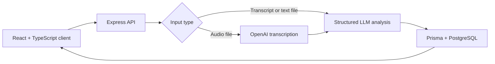

# AI Meeting Assistant

AI Meeting Assistant turns meeting transcripts or audio recordings into structured, reviewable CRM work: summaries, action items, field-change suggestions, contact updates, and follow-up email drafts.

> No public deployment is currently linked. The application is designed to run locally with Docker Compose or separate Node.js development processes.

## Product workflow

1. Paste a transcript, upload a text file, or upload a supported audio file.
2. Audio is transcribed with the configured OpenAI transcription model.
3. The transcript is sent to an OpenAI chat model with a required function-calling schema.
4. The server stores the summary, participants, action items, proposed CRM changes, and email draft in PostgreSQL.
5. Users review the results through meeting, contact, and pipeline views.

## Architecture



## Key features

- Transcript entry and drag-and-drop text-file input
- Audio upload and Whisper transcription for MP3, MP4, MPEG, MPGA, M4A, WAV, and WebM files
- Structured meeting summaries produced through LLM function calling
- Action-item extraction with optional assignees and due dates
- CRM field-change detection with approve/dismiss review states
- Follow-up email drafting
- Contact management with search and status filters
- Pipeline Kanban board for prospect, onboarding, active, and inactive contacts
- Docker Compose environment for the client, API, and PostgreSQL

## Processing pipeline

The agent requires a `save_meeting_analysis` tool call. Its schema defines the expected summary, participants, action items, CRM changes, and optional follow-up email. The API parses that structured result and writes related records in a Prisma transaction.

Representative output shape:

```json
{
  "summary": "The advisor and client reviewed an updated retirement plan.",
  "participants": ["Advisor", "Client"],
  "actionItems": [
    {
      "description": "Send updated retirement projections",
      "assignee": "Advisor",
      "dueDate": null
    }
  ],
  "crmChanges": [
    {
      "contactName": "Client",
      "fieldName": "Risk Tolerance",
      "oldValue": "Aggressive",
      "newValue": "Moderate Growth"
    }
  ],
  "followUpEmail": {
    "subject": "Follow-up: retirement plan updates",
    "body": "Thank you for meeting today...",
    "to": ["Client"]
  }
}
```

This example documents the schema; generated content depends on the supplied meeting and configured model.

## Technology stack

| Layer | Technology |
| --- | --- |
| Frontend | React 19, TypeScript, Vite, Tailwind CSS |
| API | Node.js, Express, TypeScript |
| Data | PostgreSQL, Prisma ORM |
| AI | OpenAI chat function calling and audio transcription |
| Testing | Vitest |
| Infrastructure | Docker, Docker Compose, Nginx |

## Local setup

### Prerequisites

- Node.js 22 or newer
- PostgreSQL 16 or Docker Desktop
- OpenAI API key

```bash
git clone https://github.com/ZadBabaei/ai-meeting-assistant.git
cd ai-meeting-assistant
npm ci
cp .env.example server/.env
```

Update `server/.env`, then prepare the database and start the two development processes:

```bash
cd server
npx prisma migrate dev
cd ..
npm run dev:server
```

In another terminal:

```bash
npm run dev:client
```

The client runs at `http://localhost:5173` and the API at `http://localhost:3001` during Vite development.

### Docker Compose

```bash
cp .env.example .env
# Set OPENAI_API_KEY in .env
docker compose up --build
```

The Docker client is served at `http://localhost`, and the API is exposed on port `3001`.

## Environment variables

| Variable | Required | Purpose |
| --- | --- | --- |
| `DATABASE_URL` | Yes | PostgreSQL connection string |
| `OPENAI_API_KEY` | Yes | OpenAI API authentication |
| `OPENAI_CHAT_MODEL` | No | Chat model used for structured analysis; defaults to `gpt-4o` |
| `OPENAI_TRANSCRIPTION_MODEL` | No | Audio transcription model; defaults to `whisper-1` |
| `PORT` | No | API port; defaults to `3001` |
| `NODE_ENV` | No | Runtime environment |
| `VITE_API_URL` | Client build | Browser API base URL |

Never commit populated `.env` files.

## API overview

| Method | Endpoint | Purpose |
| --- | --- | --- |
| `GET` | `/api/meetings` | List meetings |
| `POST` | `/api/meetings` | Create a transcript-based meeting |
| `POST` | `/api/meetings/upload` | Upload an audio recording for transcription |
| `GET` | `/api/meetings/:id` | Load a meeting and its extracted records |
| `POST` | `/api/meetings/:id/process` | Start structured transcript analysis |
| `DELETE` | `/api/meetings/:id` | Delete a meeting |
| `GET` | `/api/contacts` | Search and filter contacts |
| `POST` | `/api/contacts` | Create a contact |
| `PATCH` | `/api/contacts/:id` | Update a contact |

## Testing and verification

```bash
npm run lint
npm test
npm run build
docker compose config
```

The current Vitest suite mocks the OpenAI client and verifies structured extraction, CRM field changes, invalid tool responses, and follow-up email output.

## Privacy and data handling

- Meeting transcripts and extracted CRM records are stored in PostgreSQL.
- Audio is uploaded to temporary server storage and deleted after successful transcription.
- Transcript or audio content is sent to the configured OpenAI API.
- The repository contains example transcripts; do not replace them with real client information.
- Production deployments should add authentication, authorization, retention rules, encryption, audit logging, and explicit user consent before processing sensitive meetings.

## Known limitations

- Authentication and role-based access control are not implemented.
- Background transcription and analysis use in-process asynchronous work rather than a durable queue.
- Failed transcription can leave a temporary upload that requires cleanup.
- Structured tool arguments are parsed but are not yet validated with a runtime schema.
- The test suite does not currently cover database routes, uploads, or end-to-end browser flows.
- No public demo or product screenshot is currently committed.

## License

This project is available under the [MIT License](LICENSE).

<!-- add-to-portfolio
title: "AI Meeting Assistant"
description: "Meeting workflow application that turns transcripts and audio into structured CRM actions and follow-up drafts."
tags: ["React", "TypeScript", "Node.js", "PostgreSQL", "OpenAI", "Docker"]
live: ""
image: ""
-->
